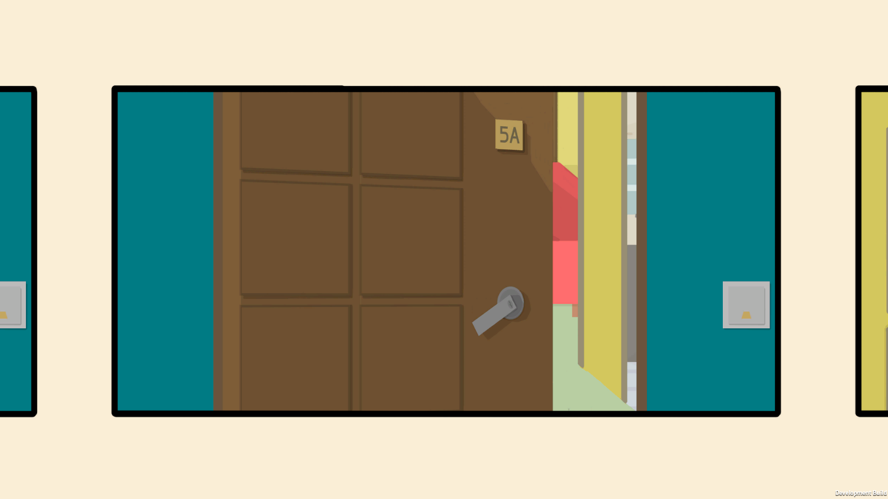
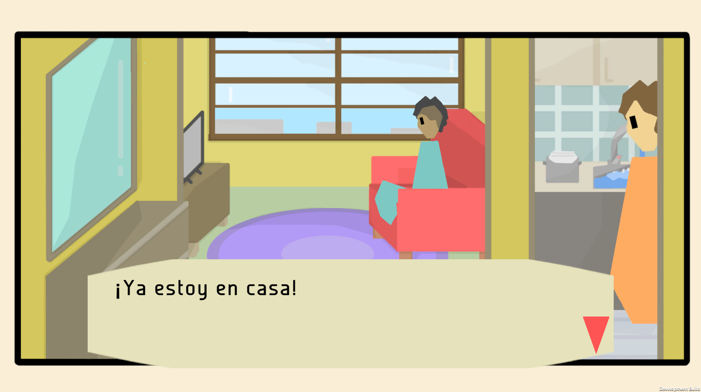
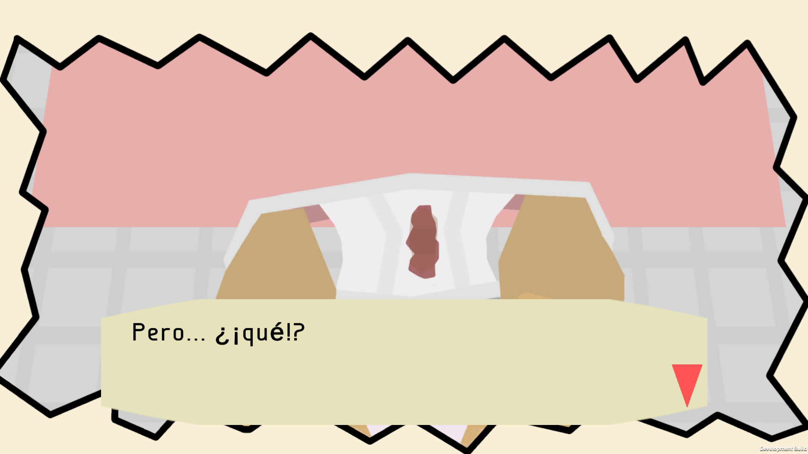
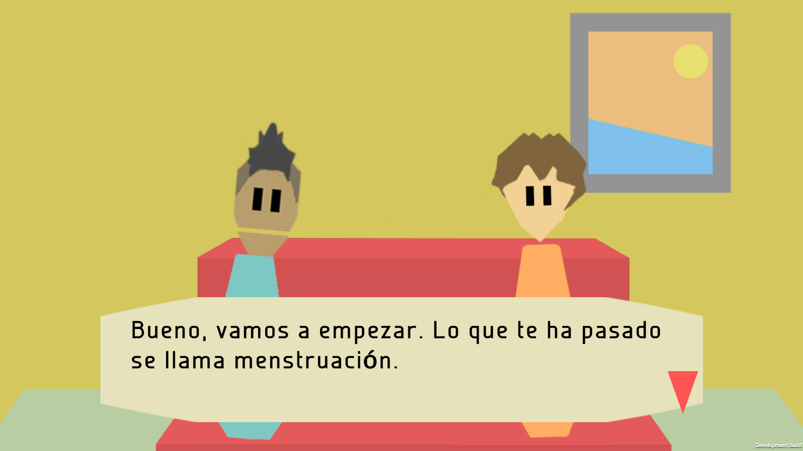

# MENSTRUAN-3

Videojuego que explica la menstruación a (mayormente) niñas y pre-adolescentes para evitar que su primera experiencia
con el período sea con temor. Pretende informar acerca del proceso y de las partes del cuerpo involucradas
de forma muy amable y poco distendida, pues al final el público no es capaz de retener tanto información
en tan poco tiempo. Además, debe seguir resultando atractivo.

La estructura del juego es la siguiente:
- Introducción
- información acerca de la menstruación
- Minijuego que acompaña a la información dada
- "Quiz" (una serie de preguntas) acerca de la información dada
- Repetir desde el paso 2 hasta final de información

Estéticamente se quería buscar una estética parecida a Majotori, el famoso juego de preguntas, que es visualmente muy simple y agradable.

Algunas imágenes del juego:

Autores:
- Nahia Iglesias Calvo  
- David Rivera Martínez
- Roi Quintas Diz